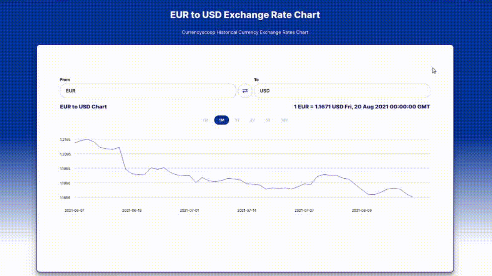
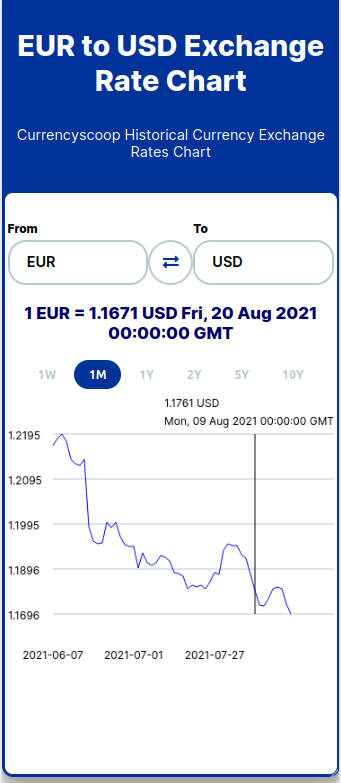

# Currency Graph

A web application utilizing the Frankfurter API (https://www.frankfurter.app) to display current and historical foreign exchange rates. Users can select specific currencies and view exchange rate trends over various time periods, presented on a graph.

## Purpose

The purpose of this project was to increase JavaScript programming competence and practice integrating third-party APIs.

## Demo

This project is hosted on Vercel: https://currency-graph.vercel.app/

## Application usage overview

### Mobile version

